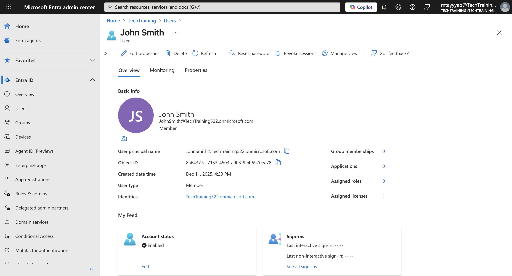
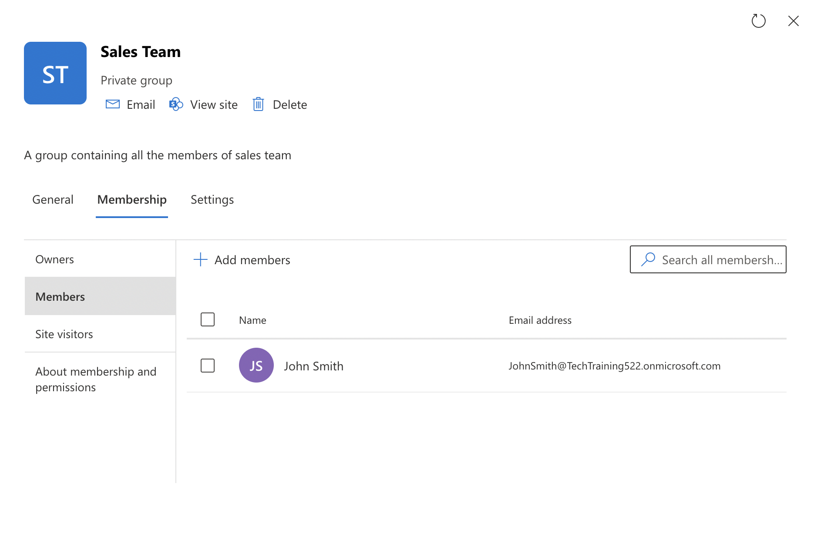
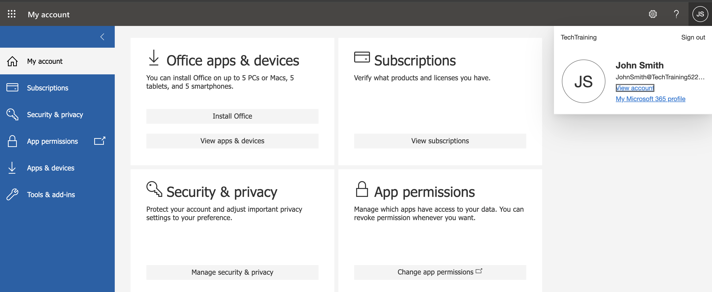
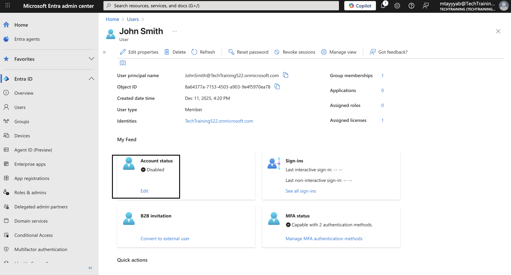
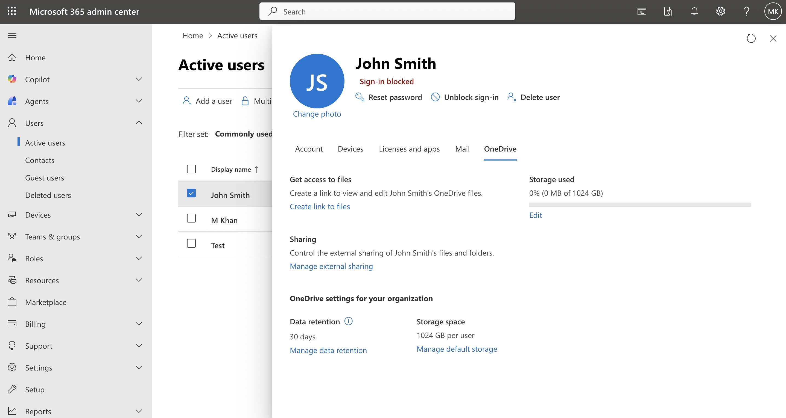
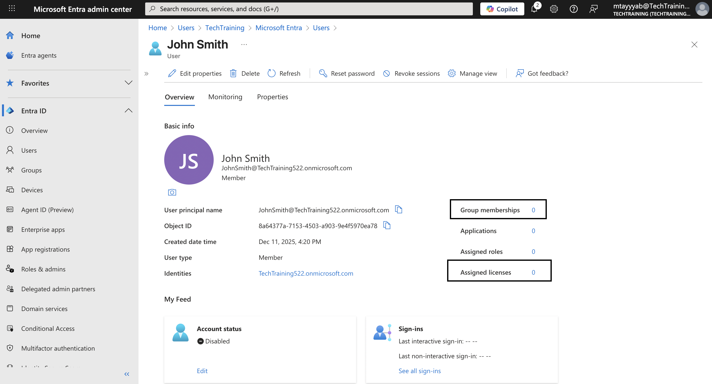
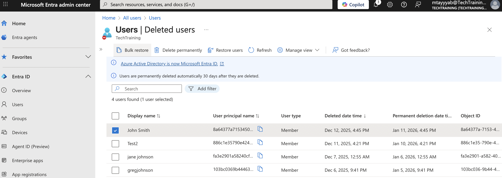

# Microsoft 365 User Lifecycle Management (Onboarding & Offboarding) Demo

## Overview

This project demonstrates a structured, end-to-end workflow for provisioning and deprovisioning user accounts in a Microsoft 365 environment. It covers identity creation, license assignment, group-based access provisioning, security enforcement, and access removal using standard administrative tools. The goal is to simulate the lifecycle of a typical employee account while following realistic IT operations and security practices. Each step includes supporting evidence to validate that the configuration and expected outcomes were achieved.

---

## Scope & Technologies

- Microsoft Entra ID  
- Microsoft 365 Admin Center  
- Conditional Access  
- Multi-Factor Authentication (MFA)  
- Microsoft 365 Groups  
- SharePoint Online  
- Microsoft Teams  
- OneDrive for Business  

---

## Step 1: Create a New User Account in Microsoft Entra ID

A new cloud-only user account, **John Smith**, was created in the Microsoft Entra Admin Center to serve as the identity object for the onboarding workflow. The user’s basic information, job details, and usage location were configured according to standard provisioning requirements. A Microsoft 365 E3 license was assigned to enable core productivity services, including Exchange Online, Teams, OneDrive, and SharePoint. The account was verified on the User Overview page to confirm that the identity attributes, license assignment, and account status were correctly applied.

---

## Step 2: Create a Microsoft 365 Group and Assign Membership

A Microsoft 365 Group named **Sales Team** was created to establish a collaborative resource container for onboarding and access management. The group was configured with private visibility and initially without an associated Microsoft Teams workspace, aligning with standard organizational practices for controlled access. The newly created user, **John Smith**, was added as a member of the group to ensure he inherits the appropriate permissions and shared resources associated with Microsoft 365 services.

---

## Step 3: Assign SharePoint and Teams Access Through Group Membership

The Microsoft 365 Group **Sales Team** automatically provisioned a connected SharePoint site, enabling shared file storage and document collaboration for its members. By assigning **John Smith** as a member of this group, the user inherited access to the Sales Team SharePoint site without requiring direct permission assignments. The group was later enabled for Microsoft Teams, allowing channel-based collaboration and communication while continuing to manage access through group membership.

---

## Step 4: Configure Conditional Access and MFA Requirements

To enforce secure authentication practices and protect organizational resources, a Conditional Access policy was implemented for the user account **John Smith**. The policy requires multi-factor authentication for all sign-in attempts while excluding administrative and break-glass accounts from enforcement. The policy was scoped to all cloud applications to ensure MFA enforcement across Microsoft 365 sign-in flows, aligning with modern security best practices.

---

## Step 5: Validate User Sign-In Experience

To confirm that Conditional Access enforcement was applied correctly, the user sign-in experience for **John Smith** was validated using the Microsoft 365 portal. During the initial authentication attempt, the user was prompted to configure multi-factor authentication, confirming that the MFA policy was successfully enforced.

Following completion of the MFA setup and password change, the user was able to access the Microsoft 365 home portal without issues, verifying that identity configuration, group-based access, and security controls were functioning as intended.

---

## Step 6: Initiate Offboarding by Disabling User Sign-In and Revoking Sessions

As part of the offboarding process, immediate access to organizational resources was restricted for **John Smith**. The user account was disabled to prevent further authentication attempts, and active sign-in sessions were revoked where applicable to invalidate existing access tokens. This step represents the first security action in the offboarding workflow.

---

## Step 7: Convert User Mailbox and Transfer Ownership of User Data

During offboarding, the user’s data was prepared for retention and continuity of access. The OneDrive for Business instance associated with **John Smith** was reviewed and confirmed to be provisioned, allowing administrative access to files if required. This ensures organizational data remains preserved while preventing continued user access.

---

## Step 8: Remove Licenses and Group Memberships

As part of the offboarding cleanup process, all assigned licenses and group memberships were removed from the user account **John Smith**. License removal ensures that paid subscriptions are reclaimed and prevents further access to Microsoft 365 services.

---

## Step 9: Finalize Account Deprovisioning in Microsoft Entra ID

To complete the offboarding lifecycle, the user account **John Smith** was removed from **Microsoft Entra ID** to ensure full deprovisioning. The account enters a soft-deleted state for a limited retention period, allowing recovery if required while preventing any future access.

---

## Conclusion

This project demonstrates a complete Microsoft 365 user lifecycle, from onboarding and access provisioning through security enforcement and final offboarding. The workflow reflects real-world administrative practices used to manage identity, access, and data retention in enterprise Microsoft 365 environments.
